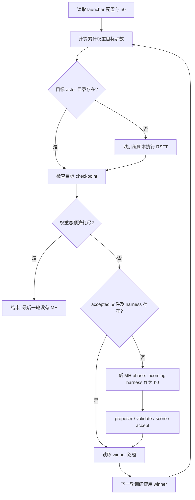

# WHALE 代码解剖

审读日期：2026-09-09。固定 commit：`fbe125eb7abea7f760c99ab9acc1a6261e708fc6`。以下“代码事实”来自此 checkout；“论文设定”来自 [WHALE v1](https://arxiv.org/html/2609.00196v1)；“风险”是静态审查推断，尚未运行 GPU 验证。WHALE 是 baseline/infrastructure。

## 0. 阅读范围和路径地图

仓库有 1,536 个 tracked 文件，其中 1,438 个在三份 vendored `verl/` 下。完成目录盘点及研究执行链审读：全部 12 个 condition launcher、共享循环、三域 base harness、proposer task/skill/acceptance、benchmark、数据说明与关键 builder、RSFT trainer/actor、reward、harness hooks、checkpoint 路径。未把与这条执行链无关的 Megatron/VLA 等 vendored 模块冒称为逐行审计；运行时等价性仍需阶段 2 验证。

| 层 | 关键路径 | 作用 |
|---|---|---|
| 外层 | `run/lib/alternate.sh` | 权重 phase 与 harness phase 编排 |
| 入口 | `domains/{search_qa,math_reasoning,chess_puzzles}/run/` | 每域 weight-only / harness-only / fixed / adaptive |
| 初始 harness | `domains/<domain>/environments/<env>/base_harness.py` | SearchR1、ReTool、Chess 的 h0 |
| 搜索 | `domains/<domain>/meta_harness/meta_harness_*.py` | proposer、候选、archive、acceptance |
| 评分 | `meta_harness/benchmark.py` 或 `chess_puzzle_benchmark.py` | 候选评测、缓存、frontier |
| 训练 | `scripts/*train*.sh` → preamble → `verl/trainer/ppo/ray_trainer.py` | on-policy rollout、RSFT、resume |
| 训练损失 | `verl/workers/actor/dp_actor.py:update_sft_policy` | accepted response token 的交叉熵 |
| Chess 运行器 | `autoharness_chess_puzzle/{harness,runner,grpo_dataset}.py` | 解析、合法性、固定答案序列、数据 |

注意：三域的 `verl/` 本身就是 Python 包，路径不是 `verl/verl/`。上游 `SKILL.md` 在本轮作为 proposer prompt 的研究材料读取，没有执行其中要求的生成或实验操作。

## 1. 交替循环的确切控制流

源：[alternate.sh 全文](https://github.com/krafton-ai/WHALE/blob/fbe125eb7abea7f760c99ab9acc1a6261e708fc6/run/lib/alternate.sh), [Chess launcher](https://github.com/krafton-ai/WHALE/blob/fbe125eb7abea7f760c99ab9acc1a6261e708fc6/domains/chess_puzzles/run/whale.sh).

1. Launcher 设 `DOMAIN_DIR`、训练脚本、MH module/config、模型、h0、总步数、每轮步数，`exec bash alternate.sh`。
2. `main` 每次启动把 harness 置为 `BASE_HARNESS`，cumulative 和 round 置零。恢复依赖逐轮重走文件检查，并非加载一个全局交替状态。
3. 只要累计步数小于总步数且 round 小于 `MAX_ROUNDS`，round 加一，累计目标增加 `ROUND_STEPS`，截断到 `TOTAL_STEPS`。
4. 预计 checkpoint 为 `$CKPT_ROOT/$RUN_NAME/global_step_<累计目标>/actor`。目录存在就跳过权重 phase；没有 manifest 完整性或数据/模型/harness hash 检查。
5. 否则 `run_weight_phase` 用子 shell 导出 `HARNESS_PATH`、`RUN_NAME`，执行域训练脚本；同时把 harness 放进 Ray runtime env，传入**累计** `trainer.total_training_steps` 和 online RSFT 开关、epoch、minibatch、threshold。
6. 训练器是否从旧权重、optimizer、sampler 继续，由域训练脚本的 resume 配置决定。共享循环没有显式传前一 checkpoint 或强制 resume。
7. 返回后，必须存在第 4 步的 actor 目录，否则 exit 3。它没有读取训练器实际结束步数。
8. **若权重预算耗尽，立即退出，没有最后一次 MH phase。** 若因 `MAX_ROUNDS` 结束也打印 done，不能据此认定用满预算。
9. 否则调用 `run_harness_phase`：每轮新目录 `meta_harness/runs/mh-<run>-round<r>`。如存在 accepted 名称及对应 harness 文件，就复用；否则导出 incoming harness 为 `BASELINE_HARNESS_OVERRIDE`，checkpoint 的 global_step 根目录为 `VLLM_MODEL`，执行 MH module。
10. MH 把 incoming harness 复制成当前 phase 的 h0，先评测 h0，再反复 proposer → metadata → validate → evaluate → frontier → acceptance。完整 archive 在**这个 MH phase 内**；下轮只携带赢家代码，外层不自动搬运完整旧 archive。
11. 返回 `harnesses/<winner>/harness.py` 路径，供下一权重 phase 使用。错误任一步终止；没有科学结果汇总器。

下面是本项目依据源码重画的控制图，不是原论文图：

### 1.1 不能把变量 hand-off 当作真正模型 hand-off

- 三域 MH `load_config` 直接读取 JSON，模型取 `config.models`；这条模块路径没有消费 `VLLM_MODEL`。[Chess sweep](https://github.com/krafton-ai/WHALE/blob/fbe125eb7abea7f760c99ab9acc1a6261e708fc6/domains/chess_puzzles/meta_harness/chess_puzzle_benchmark.py#L49)，[Math config loader](https://github.com/krafton-ai/WHALE/blob/fbe125eb7abea7f760c99ab9acc1a6261e708fc6/domains/math_reasoning/meta_harness/benchmark.py#L38)。独立服务启动脚本存在于其他路径，但共享循环没有调用它们。
- 因此导出 checkpoint 路径既不完成 FSDP → HF 导出，也不启动/切换 MH 的 vLLM 服务。phase 开始前必须核验实际服务模型权重 hash，而不只是模型名。
- [checkpoint 保存](https://github.com/krafton-ai/WHALE/blob/fbe125eb7abea7f760c99ab9acc1a6261e708fc6/domains/chess_puzzles/verl/trainer/ppo/ray_trainer.py#L928) 写 actor、optimizer 和 `data.pt`；HF config/tokenizer 默认在 `actor/huggingface/`，完整 HF weights 是可选保存项。[保存器](https://github.com/krafton-ai/WHALE/blob/fbe125eb7abea7f760c99ab9acc1a6261e708fc6/domains/chess_puzzles/verl/utils/checkpoint/fsdp_checkpoint_manager.py#L252)。global_step 根目录不能直接假定是可服务 HF 模型。
- SearchQA 域训练默认 `RESUME_MODE=disable`，Math/Chess 是 auto。外层不覆盖它，故 SearchQA 默认后轮可能从 base 重新训练到更大的累计目标，而非持久续训。[SearchQA defaults](https://github.com/krafton-ai/WHALE/blob/fbe125eb7abea7f760c99ab9acc1a6261e708fc6/domains/search_qa/scripts/nq_hotpotqa/train_grpo_qwen3_5_2b_paper.sh#L257)。
- 外层用 `CKPT_ROOT`，训练脚本用 `OUTPUT_ROOT`；只改前者会分叉保存/查找位置。
- `accepted_harness.txt` 在 MH 初始化、基线评测前已经写出。故中断后它存在**不等于 phase 完成**；外层可能直接跳过未完成搜索。[初始化](https://github.com/krafton-ai/WHALE/blob/fbe125eb7abea7f760c99ab9acc1a6261e708fc6/domains/chess_puzzles/meta_harness/meta_harness_chess_puzzle.py#L426)。需要独立完成标志和身份核验，这是复现修复，不是科学增量。

## 2. fixed duration 与 adaptive patience 的位置

### 2.1 Fixed

`alternate.sh:139–158` 以 `ROUND_STEPS` 切权重 phase；`:104–110` 用 `--iterations` 切 MH。源码用的单位是 rollout step，不是 SFT optimizer step。一次 rollout step 内 accepted 数不同，会触发不同数量的 SFT minibatch 更新。

| 域 | launcher 总步数 | 默认每轮权重步数 | 默认新增 MH iterations |
|---|---:|---:|---:|
| SearchQA | 296 | 15 | 5 |
| Math | 420 | 14 | 5 |
| Chess | 256 | 13 | 5 |

默认描述为 `(0.2 epoch, I=6)`，论文主表是 `(0.6,6)`，不要直接比。[reproducing.md](https://github.com/krafton-ai/WHALE/blob/fbe125eb7abea7f760c99ab9acc1a6261e708fc6/docs/reproducing.md) 用 I 包含 incoming h0 评测，所以给模块 5 次新增 iteration。每次新增 iteration 生成 3 候选；h0 只评测一份。若全集 256、无缓存/失败，则一个 phase 的 **目标模型采样数量算术**为 `256 × (1 + 5 × 3) = 4096`，不是已测成本。论文计数如何对应公开脚本需显式对账。

### 2.2 权重 adaptive：trainer 有逻辑，但 launcher 未接线

三域 `verl/trainer/ppo/ray_trainer.py:_fit_online_rsft` 都有 `trainer.online_rsft.early_stop`：

- SearchQA：配置约 1481 起，判据约 1624 起。
- Math：[1489–1498](https://github.com/krafton-ai/WHALE/blob/fbe125eb7abea7f760c99ab9acc1a6261e708fc6/domains/math_reasoning/verl/trainer/ppo/ray_trainer.py#L1489)、[1632–1671](https://github.com/krafton-ai/WHALE/blob/fbe125eb7abea7f760c99ab9acc1a6261e708fc6/domains/math_reasoning/verl/trainer/ppo/ray_trainer.py#L1632)。
- Chess：配置约 1503 起，判据约 1648 起；入口的 disaggregated trainer 继承同一个 RayPPOTrainer。

启用时读 `critic/score/mean`，保存本 phase reward 序列；window_steps > 0 时取最近窗口，否则全历史均值。只有严格 `>` 创新高才重置 best_step。实际停止须同时满足：本 phase 已走步数 **> burn_in_steps**，以及距离 best_step **>= patience_steps**。窗口未满仍会计算前缀均值；没有显著性阈值。信号缺失则不触发。提前退出前按设置保存 checkpoint、做 validation、返回。

**发布代码问题：** adaptive launcher 只导出 `ADAPTIVE=1` 和 phase 长度/MH 参数；`run_weight_phase` 不传 `early_stop.enable/window_steps/burn_in_steps/patience_steps`。训练脚本也不据 `ADAPTIVE` 设置它们，所以默认权重 phase 仍然固定长度。即便外部开启 trainer early stop，外层仍期待预定累计目标 checkpoint，提前停止可能被当作缺 checkpoint。不能把这份公开 adaptive 入口作为论文 patience baseline 不经修复就运行。

### 2.3 Harness adaptive

共享脚本传 `--iterations=15`、`--early-stop-min-iters=5`、`--early-stop-patience=2`。

| 域 | 初始化 | 判据 |
|---|---|---|
| SearchQA | `meta_harness_search_r1.py:440–443` | [656–682](https://github.com/krafton-ai/WHALE/blob/fbe125eb7abea7f760c99ab9acc1a6261e708fc6/domains/search_qa/meta_harness/meta_harness_search_r1.py#L656) |
| Math | `meta_harness_retool.py:706–709` | [894–920](https://github.com/krafton-ai/WHALE/blob/fbe125eb7abea7f760c99ab9acc1a6261e708fc6/domains/math_reasoning/meta_harness/meta_harness_retool.py#L894) |
| Chess | `meta_harness_chess_puzzle.py:450–454` | [557–584](https://github.com/krafton-ai/WHALE/blob/fbe125eb7abea7f760c99ab9acc1a6261e708fc6/domains/chess_puzzles/meta_harness/meta_harness_chess_puzzle.py#L557) |

取 frontier 全 archive 最好训练成功率；严格增加才更新 best_iter；iteration >= min 且 iteration−best_iter >= patience 时停。best 初始为 −∞，并非直接初始化为 incoming h0 的分数。检查用 frontier 的四位小数。Chess 还有独立的候选成功率到 1.0 即停，优先于 patience，可能越过 minimum。`MH_MAX_ITERS` 是公开脚本额外上限。

## 3. RFT phase：reward、filter、loss

此处 RFT 的准确实现是 online rejection-sampling fine-tuning（RSFT）。脚本里遗留 `grpo` 命名不代表主路径使用 GRPO loss；enable 后分流至 `_fit_online_rsft`。

1. 从持久 dataloader 取 prompt batch，每 prompt 默认采样 8 个 trajectory。
2. 用域 verifier 得到 token reward tensor，沿 token 维求和为 sequence score。
3. **`sequence_scores > 0.5`** 被接受，不是 >=，也不是选 top-k、每题只留一个或仅挑 best response。
4. accepted 全部交给一次默认 SFT epoch；没有跨 rollout-step replay buffer。没有 accepted 时跳过 optimizer update，但 rollout step 和成本仍计入。
5. 模型生成 token 的 `response_mask=1`；工具/用户/环境 token 为 0。多卡补齐的假样本 mask 清零。[补齐](https://github.com/krafton-ai/WHALE/blob/fbe125eb7abea7f760c99ab9acc1a6261e708fc6/domains/chess_puzzles/verl/trainer/ppo/ray_trainer.py#L1439)。
6. [actor loss](https://github.com/krafton-ai/WHALE/blob/fbe125eb7abea7f760c99ab9acc1a6261e708fc6/domains/math_reasoning/verl/workers/actor/dp_actor.py#L679) 是 accepted response token 的负 log likelihood，microbatch 按有效 token 数加权；默认 SFT minibatch=64、micro/GPU=2。此函数不使用 PPO ratio、GRPO group advantage、entropy reward 或 KL loss。默认 temperature=1；改 temperature 会进入 log-prob forward，不能只当采样旋钮。
7. 更新后同步 rollout weights，下一步重新采样。保存/恢复 `data.pt` 维持 sampler；缺文件会警告并重启数据，不是严格等价 resume。

### 3.1 三域 verifier 的具体差异

| 域 | 代码定义 | 容易误读之处 |
|---|---|---|
| Chess | `runner.py:verify_and_step` 用 python-chess 检查合法性，再逐个匹配 hidden solution。正确非终局先走固定对手回复；整条解完为 1，其余 0。`grpo_reward.py` 透传 rollout reward。 | 不给正确中间步 partial credit；另一条同样好的棋路若不在参考线也失败。格式/非法重试额度与 legal-wrong terminal 区分。 |
| Math | `grpo_binary_reward.py` 调 `math_dapo.compute_score(strict_box_verify=True)` 后把正值映射到 1，否则 0。 | strict 路径最终只在尾部 100 字符找最后 boxed 内容并与 gt 字符串相等，不走宽松 normalize_final_answer。工具使用不加分。MH 的 loader 文件缺失，不能声称其实际 reward 已验证等价。 |
| SearchQA | `env.py` 默认 binary normalized EM；`LLM_JUDGE=1` 才用 `llm_judge.py`。后者抽最后 assistant 的 answer，交 GPT judge；三次 API 失败回退 EM。 | 论文使用 judge；公开训练/MH 默认不自动开 judge。proposer skill 还写旧 EM/0.25 spam penalty，实际当前 scorer 已移除 0.25。 |

源：[Chess transition](https://github.com/krafton-ai/WHALE/blob/fbe125eb7abea7f760c99ab9acc1a6261e708fc6/domains/chess_puzzles/autoharness_chess_puzzle/runner.py#L346)、[Math wrapper](https://github.com/krafton-ai/WHALE/blob/fbe125eb7abea7f760c99ab9acc1a6261e708fc6/domains/math_reasoning/environments/retool/grpo_binary_reward.py), [strict parser](https://github.com/krafton-ai/WHALE/blob/fbe125eb7abea7f760c99ab9acc1a6261e708fc6/domains/math_reasoning/verl/utils/reward_score/math_dapo.py#L193)、[Search reward toggle](https://github.com/krafton-ai/WHALE/blob/fbe125eb7abea7f760c99ab9acc1a6261e708fc6/domains/search_qa/environments/search_r1/env.py#L528)、[judge fallback](https://github.com/krafton-ai/WHALE/blob/fbe125eb7abea7f760c99ab9acc1a6261e708fc6/domains/search_qa/verl/utils/reward_score/llm_judge.py#L286).

后续需记录：acceptance rate、unique accepted prompts、accepted tokens、SFT updates、空更新率、错误类型；只记录平均 reward 不足以辨别“答得更多”与“学得更好”。这是本项目提出的诊断需求，不是已观察结果。

## 4. h0、proposer prompt 与搜索空间

### 4.1 Base harness

- **SearchQA**：[base_harness.py](https://github.com/krafton-ai/WHALE/blob/fbe125eb7abea7f760c99ab9acc1a6261e708fc6/domains/search_qa/environments/search_r1/base_harness.py)；短 system/user prompt，答案 tags，MAX_TURNS=2；search(query_list, topk, max_doc_tokens) 只保留第一个 query，payload 强制 topk=1，max_doc_tokens 默认 200 但参数仍可覆盖；retriever timeout=30s，tokenizer 名硬编码 Qwen3.5-2B。
- **Math**：[base_harness.py](https://github.com/krafton-ai/WHALE/blob/fbe125eb7abea7f760c99ab9acc1a6261e708fc6/domains/math_reasoning/environments/retool/base_harness.py)；无 system prompt、boxed 输出、MAX_TURNS=2；第一个 Python fence；最后非空行若不以 print 开头便包 print，这不是 AST 检查，assignment/control line 可能变非法。工具默认 timeout=30、memory=1024 MB；无 tool call 会终止，token budget 经 usage 统计。
- **Chess**：[base_harness.py](https://github.com/krafton-ai/WHALE/blob/fbe125eb7abea7f760c99ab9acc1a6261e708fc6/domains/chess_puzzles/environments/chess_puzzle/base_harness.py)；显示 FEN、ASCII board、legal UCI/SAN、已接受步及对手回复；唯一 UCI 输出，XML/方括号/裸 UCI 按优先级解析；多个不同 move 判 ambiguous；两种 retry 默认各 1，MAX_TURNS=9。h0 不解棋。

### 4.2 Prompt 的组合方式与定位

实际 proposer 输入不只是一个字符串：`render_task_prompt(iteration,next_names)` + `claude_wrapper.load_skills` 把 skill 正文前置到 system prompt + 可读取 run archive + Chess 的额外 system boundary。

| 域 | task 模板位置 | skill 文件 | 允许 proposer 工具 |
|---|---|---|---|
| SearchQA | [meta_harness_search_r1.py:299](https://github.com/krafton-ai/WHALE/blob/fbe125eb7abea7f760c99ab9acc1a6261e708fc6/domains/search_qa/meta_harness/meta_harness_search_r1.py#L299) | [meta-harness-search-r1/SKILL.md](https://github.com/krafton-ai/WHALE/blob/fbe125eb7abea7f760c99ab9acc1a6261e708fc6/domains/search_qa/meta_harness/skills/meta-harness-search-r1/SKILL.md) | Read, Glob, Grep, Write, Edit, Bash |
| Math | [meta_harness_retool.py:320](https://github.com/krafton-ai/WHALE/blob/fbe125eb7abea7f760c99ab9acc1a6261e708fc6/domains/math_reasoning/meta_harness/meta_harness_retool.py#L320) | [meta-harness-retool/SKILL.md](https://github.com/krafton-ai/WHALE/blob/fbe125eb7abea7f760c99ab9acc1a6261e708fc6/domains/math_reasoning/meta_harness/skills/meta-harness-retool/SKILL.md) | 同 SearchQA |
| Chess | [meta_harness_chess_puzzle.py:206](https://github.com/krafton-ai/WHALE/blob/fbe125eb7abea7f760c99ab9acc1a6261e708fc6/domains/chess_puzzles/meta_harness/meta_harness_chess_puzzle.py#L206) | [meta-harness-chess-puzzle/SKILL.md](https://github.com/krafton-ai/WHALE/blob/fbe125eb7abea7f760c99ab9acc1a6261e708fc6/domains/chess_puzzles/meta_harness/skills/meta-harness-chess-puzzle/SKILL.md) | Read, Glob, Grep, Write, Edit；无 Bash |

模板字段：当前 iteration、harnesses/logs 相对目录、明确的候选槽位、准确候选数量、根目录 pending_eval.json 及顺序。metadata 保存 name/hypothesis/changes/axis/components（各域字段略异）。默认 Claude Opus 4.7、effort=max、2400s；Chess transient proposer 最多默认 5 次尝试，120s backoff。

可读证据：accepted 名称、当前/历史候选源码、frontier、evolution_summary、comparison、失败/成功预览和完整 trajectories。每次 session 通过文件重新读取经验，不是可训练 proposer。Math/Search 允许临时 prototype；Chess 禁止写 run 外。wrapper 默认禁用自动技能/MCP，仅注入指定技能。所有源码限制是上游设计，不是我们的贡献。

### 4.3 搜索空间边界：声明与执行必须分开

| 域 | 允许改变 | 固定约束 / 执行检查 |
|---|---|---|
| SearchQA | system/user prompts；query rewrite；retrieval 配置与格式；feedback、context、stop/turn allocation | tools 的首参数 query_list；一次 query 语义；MAX_TURNS cap 16；模型、参考答案、数据、judge 固定。候选表层检查主要是文件存在及 CandidateEnv 字符串；loader 检查签名。 |
| Math | prompts；code extraction/normalization；stdout/stderr 包装；tool feedback、no-tool recovery、turns | code_interpreter 的 code 参数合同；不写题目特定答案；权重更新仍用原 verifier。公开缺 env.py，不能核实宣称的完整 load-time clamp/validation。 |
| Chess | prompts、可见 board 格式、parser、history、retry budgets、turn budget | import allowlist、受限 builtins/AST；retry 各 <=10，turn cap 默认 18。不得写 engine/minimax、生成/替换 move、从隐藏信息查答案。AST 检查不能证明没有内嵌棋策略或语义作弊。 |

Chess validator：[harness.py:11–162](https://github.com/krafton-ai/WHALE/blob/fbe125eb7abea7f760c99ab9acc1a6261e708fc6/domains/chess_puzzles/autoharness_chess_puzzle/harness.py#L11)；Search load-time contract：[env.py:415](https://github.com/krafton-ai/WHALE/blob/fbe125eb7abea7f760c99ab9acc1a6261e708fc6/domains/search_qa/environments/search_r1/env.py#L415)。

搜索不是有限离散参数网格，而是受合同约束的 Python 程序。声明“参考答案固定”不代表候选代码在每一条执行路径都无法访问它；必须审查数据可见边界和实现。proposer 看到训练失败及参考答案属于 search training，不能称独立 validation。

### 4.4 Acceptance、成本和 Fast-Slow

- Math/Search 从 Pareto frontier 先最大化 avg_success_rate，再以少 turns 打破平分；Chess `_best` 同样排序。token、API 费用和下一次权重更新收益**不参与选择**。所以“完全没有成本意识”不准确：turn count 已作为 frontier/平分指标；缺的是完整成本目标。
- 每个候选通常一次/题，已有 val.json 默认缓存。跨 trial/模型权重变化时不能复用只按短模型名命名的缓存。
- 三域均保留 `--prompt-only` 和 AST 约束（除 prompt 常量及 docstring 外保持 h0），但三份 `*-promptonly/SKILL.md` 均未发布；共享交替脚本也没有传此 flag。wrapper 对缺 skill 静默不加载。没有可直接运行的完整 FST condition。
- 本项目阶段 2 的 Fast-Slow 应明确标为 **WHALE 的 FST prompt-only control（RSFT+MH）**。它不等同 [原 FST](https://arxiv.org/abs/2605.12484v2) 的完整算法；若后续声称超越原 FST，需要额外按其原协议比较。

## 5. 硬编码、可配置但脆弱的超参

| 参数/合同 | 代码状态 | 对研究的影响 |
|---|---|---|
| 每域总步数、ROUND_STEPS | launcher 默认字面量，可 env 覆盖 | subset 改大小不会自动维持 epoch 定义 |
| epoch 换算 | helper 用 ceil(N/batch)，trainer train loader drop_last=True | Math 17,917/256 的 ceil=70、floor=69；SearchQA ceil=75、floor=74；过滤长 prompt 后还会变。须记录实际 dataloader 长度。 |
| M=3 / proposer / effort / timeout | 可 env 或 CLI 设置 | 影响搜索能力和真实费用；不能不计失败重试 |
| RSFT threshold=.5 / epochs=1 / minibatch=64 | 共享脚本可配 | 在 binary reward 下阈值中间值等价；更改 verifier 后不等价 |
| adaptive window/min/patience | trainer 可配，公开外层未连接 | 三个新超参仍存在，不是完全无超参 |
| 全部 seeds=[42] | JSON 单 seed | MH seed 不是完整训练/proposer 随机重复；Chess seed 还会改变截取的评测子集 |
| Chess response=16384 vs assistant=8129 | 两个独立预算，JSON/skill 默认8129 | 一个包含 response region，另一个只算 assistant；不能只看论文 length 就互换 |
| max turns/retries/strict boxed尾窗 | 源码常数或 env cap | 改动可能改变任务有效难度或 reward semantics |
| h0 parser/tool wrapping | 代码固定 | 简单 parser 修复可能解释收益；需强手工 harness 对照 |
| 两个评测实现 | verifiers/LLMClient vs verl agent loop | `meta_harness_hook` 对部分异常 warning 后 fallback；“搜索评测好，训练没执行同机制”需真实 trace 排除 |
| 模型、依赖、数据版本 | 没有统一锁文件、数据 revision/hash | 不能只用 seed 重建论文数据/数值 |
| checkpoint 与 MH cache | 文件存在即信任，部分 key 无模型hash | 半完成运行或同名不同模型可能错误复用 |

多 seed 特别风险：[Chess load_results](https://github.com/krafton-ai/WHALE/blob/fbe125eb7abea7f760c99ab9acc1a6261e708fc6/domains/chess_puzzles/meta_harness/chess_puzzle_benchmark.py#L107) 的字典 key 不含 seed，多 seed val.json 会覆盖而非聚合。未来应运行三个独立 run 目录并在 ours 中汇总，不能仅把 JSON seeds 改为三个数后信任 `_best`。

## 6. 数据/依赖与阶段 2 前置缺口

源：[docs/data.md](https://github.com/krafton-ai/WHALE/blob/fbe125eb7abea7f760c99ab9acc1a6261e708fc6/docs/data.md), [docs/reproducing.md](https://github.com/krafton-ai/WHALE/blob/fbe125eb7abea7f760c99ab9acc1a6261e708fc6/docs/reproducing.md)。这里记录的是静态 release completeness 检查，不是已经跑失败的实验。

| 问题 | 可定位证据 | 处置要求 |
|---|---|---|
| 数学环境 loader 缺失 | `meta_harness_retool.py:49` 引用 `environments/retool/env.py`，git tree 无此文件 | 获得原始文件/可确认等价版本前不能声称原 pipeline 已复现 |
| 数学 recipe 与本地 patch 缺失 | `train_grpo_qwen3_5_2b_retool.sh:16–35` 硬检查 CustomSandboxFusionTool；recipe、patch 都不在 tree | 不能拿任意新版 recipe 冒充同一 baseline |
| Chess LLM client 缺失 | `runner.py:16–17` 导入 autoharness_textarena.config/llm；repo 和 requirements 未提供可定位来源 | 先恢复来源，不能把自己实现的 client 当上游原版 |
| Search MH JSON 缺失 | `CONFIG_PATH=config-search-r1.json`，tree 无文件 | TOML 属另一 launcher，未被共享 loop 使用 |
| 安装命令不完整 | 文档 pip install -e verl；三份 verl 均无 setup.py/pyproject.toml | 需锁定依赖并确认 import 来自正确域，不覆盖既有项目环境 |
| FST 入口不完整 | 有 AST mode，无 prompt-only skill/launcher | 原 FST 与 WHALE-FST 分别声明；恢复步骤留来源/patch |
| Chess test 文件不一致 | builder 默认 test_1024，训练默认 test_256；没有固定论文256个ID清单 | 同 seed 不足以保证论文 test256 一致 |
| Search 数据 builder 与正文目标不一致 | build_meta_harness_nq_256 依赖已有128 NQ，生成 NQ-only；docs 默认 mh_dist_align_256 | 不假设得到正文的200 Hotpot+56 NQ混合 |
| 数据角色并不都互斥 | Math 的 MH 从 weight pool 抽；Search helper 明确要求为train子集；Chess按position去重分开 | weight/harness train重叠不是test泄漏，但必须实测哈希、固定角色 |
| 资源默认不是小卡方案 | Chess 默认trainer 4 GPU + standalone rollout 2×6 GPU；math需sandbox；Search大索引/judge | 最便宜域先选Chess的成本判断仅为结构推断，必须在缺口恢复后smoke实测 |

公开文档自己说明 launcher 只验证过 stubs，没有端到端 GPU 复跑。这些缺口决定阶段 2 有实质风险，**不否定原论文实验，也不构成我们的科学贡献**。阶段 1 审批前不修复、不装依赖、不下载训练数据、不提交 GPU。

## 7. 与论文比较时必须冻结的口径

mean@8 是每题8次样本的平均正确率再对题求均值，不是 pass@8，也不是8个独立训练种子。论文 best-on-test 与我们的最终预算 checkpoint 是不同指标；后续主结果须事前选 checkpoint，测试集不参与选择。阶段 2 可另列论文历史 best 数值作参照并解释不可比项；小 subset 只能证明管线可运行，不能替代 full-budget 数值复现。

完整论文中的 schedule study 已经存在；“原作没做切换消融”不成立。应把新的攻击点限定为当前 score 与后续学习效用、测量噪声、完整预算、可迁移性以及复现控制。这些点见 [attack_surface.md](attack_surface.md)。
